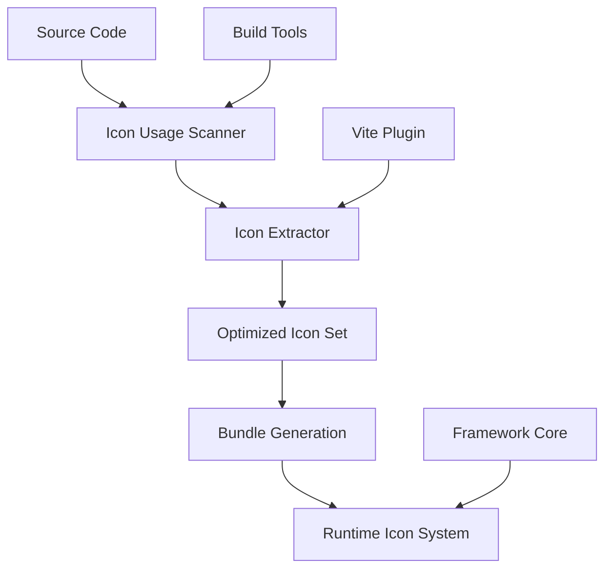
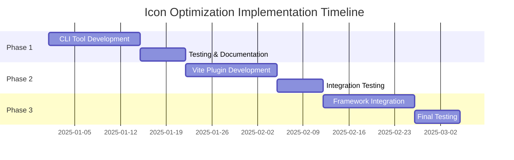

---
cssclasses:
  - full-page
---

# Enhancement: Intelligent Icon Bundle Optimization

## Overview

**Status**: Design Phase  
**Priority**: High  
**Estimated Effort**: 3-4 weeks  
**Target Release**: TachUI 1.1  

### Problem Statement

The current icon system bundles the entire Lucide library (620KB) regardless of actual usage, leading to:
- 74% unnecessary bundle bloat in typical applications
- Poor loading performance on slower connections  
- Suboptimal caching due to large chunks
- Developer frustration with bundle size warnings

### Success Criteria

1. **Bundle Size**: Achieve 80-95% reduction in icon-related bundle size for typical apps
2. **Developer Experience**: Zero-configuration automatic optimization
3. **Compatibility**: Maintain 100% API compatibility with existing Symbol components
4. **Performance**: Sub-100ms icon loading with proper caching
5. **Maintainability**: Eliminate manual icon curation requirements

---

## Technical Design

### Architecture Overview



### Core Components

#### 1. Icon Usage Analysis Engine

**Purpose**: Scan source code to identify used icons at build time

```typescript
interface IconUsageAnalyzer {
  scanDirectories(paths: string[]): Promise<Set<string>>
  scanFile(filePath: string): string[]
  extractIconNames(content: string): string[]
  generateUsageReport(): IconUsageReport
}

interface IconUsageReport {
  totalIcons: number
  usedIcons: string[]
  unusedIcons: string[]
  savingsEstimate: BundleSizeInfo
}
```

**Implementation Strategy**:
- AST-based parsing for TypeScript/JavaScript files
- Regex-based scanning for rapid prototyping
- Support for dynamic icon names through static analysis
- Integration with TypeScript compiler API for accuracy

#### 2. Icon Data Extraction System

**Purpose**: Extract SVG data from icon libraries efficiently

```typescript
interface IconExtractor {
  extractIcon(name: string, library: string): Promise<IconDefinition>
  extractBatch(names: string[], library: string): Promise<Map<string, IconDefinition>>
  validateIconData(data: any): boolean
  normalizeIconFormat(data: any): IconDefinition
}

interface IconDefinition {
  name: string
  svg: string
  viewBox: string
  metadata?: IconMetadata
}
```

**Implementation Strategy**:
- Direct integration with Lucide's export format
- Extensible plugin system for other icon libraries (Heroicons, Feather, etc.)
- SVG optimization and minification
- Caching layer for repeated extractions

#### 3. Build-time Optimization Engine

**Purpose**: Generate optimized icon bundles during build process

```typescript
interface OptimizationEngine {
  generateOptimizedIconSet(usedIcons: string[]): OptimizedIconSet
  createTreeShakableExports(icons: IconDefinition[]): string
  optimizeSVGData(svg: string): string
  generateTypeDefinitions(icons: string[]): string
}

interface OptimizedIconSet {
  iconData: Record<string, IconDefinition>
  metadata: OptimizationMetadata
  typeDefinitions: string
  bundleSize: number
}
```

#### 4. Runtime Icon System

**Purpose**: Efficiently serve optimized icons at runtime

```typescript
interface RuntimeIconSystem extends IconSet {
  loadIcon(name: string): Promise<IconDefinition | undefined>
  preloadCriticalIcons(names: string[]): Promise<void>
  getCacheStats(): CacheStatistics
  fallbackToFullLibrary(): Promise<void>
}
```

---

## Implementation Options

### Option 1: Tacho CLI Integration 🔧

**Scope**: Extend existing Tacho CLI with icon optimization commands

#### Technical Implementation
- **Integration Point**: Extend `@tachui/cli` package with new commands
- **Architecture**: Plugin-based commands following existing Tacho CLI patterns
- **File Processing**: Leverage existing Tacho project detection and configuration
- **Icon Processing**: Direct Lucide imports with dynamic loading

#### Code Architecture
```typescript
// packages/cli/src/commands/icons/optimize.ts
export class OptimizeIconsCommand implements TachoCommand {
  name = 'icons:optimize'
  description = 'Optimize icon bundles by extracting only used icons'
  
  async execute(context: TachoContext, options: OptimizeIconsOptions): Promise<void> {
    const project = await context.detectProject()
    const optimizer = new IconOptimizer(project.config)
    
    const usageReport = await optimizer.scanProject()
    const optimizedSet = await optimizer.extractIcons(usageReport.usedIcons)
    
    await optimizer.generateOutput(optimizedSet, options.outputPath)
  }
}

// packages/cli/src/commands/icons/analyze.ts  
export class AnalyzeIconsCommand implements TachoCommand {
  name = 'icons:analyze'
  description = 'Analyze icon usage and potential bundle savings'
  
  async execute(context: TachoContext): Promise<void> {
    // Generate comprehensive usage analysis and savings report
  }
}

interface OptimizeIconsOptions {
  srcDirs?: string[]
  outputPath?: string
  library?: 'lucide' | 'heroicons' | 'feather'
  optimization?: 'basic' | 'aggressive'
  dryRun?: boolean
}
```

#### Tacho CLI Integration
```bash
# New Tacho CLI commands
tacho icons optimize                    # Auto-optimize with smart defaults
tacho icons optimize --dry-run          # Preview optimization without changes
tacho icons analyze                     # Show usage analysis and savings
tacho icons analyze --detailed          # Detailed per-component analysis

# Integration with existing commands
tacho build --optimize-icons           # Auto-optimize during build
tacho dev --watch-icons                # Auto-reoptimize on icon changes
tacho init --template optimized        # Initialize project with icon optimization
```

#### Tacho Configuration Integration
```typescript
// tacho.config.ts
export default defineTachoConfig({
  icons: {
    optimization: {
      enabled: true,
      library: 'lucide',
      level: 'aggressive',
      outputPath: 'src/icons/optimized.ts',
      srcDirs: ['src', 'components'],
      excludePatterns: ['**/*.test.ts', '**/*.stories.ts']
    },
    analysis: {
      showSavings: true,
      warnOnLargeIcons: true,
      suggestAlternatives: true
    }
  }
})
```

#### Build Integration
```json
// package.json - cleaner integration
{
  "scripts": {
    "prebuild": "tacho icons optimize",
    "build": "tacho build --optimize-icons", 
    "dev": "tacho dev --watch-icons",
    "analyze": "tacho icons analyze"
  }
}
```

#### Integration with Existing Tacho CLI Architecture

**Command Structure**:
```typescript
// packages/cli/src/commands/index.ts
export { OptimizeIconsCommand } from './icons/optimize.js'
export { AnalyzeIconsCommand } from './icons/analyze.js'
export { WatchIconsCommand } from './icons/watch.js'

// Extend existing commands
export class BuildCommand {
  // Add --optimize-icons flag to existing build command
  async execute(context: TachoContext, options: BuildOptions) {
    if (options.optimizeIcons) {
      await new OptimizeIconsCommand().execute(context, {})
    }
    // Continue with normal build process
  }
}
```

**Configuration Integration**:
```typescript
// packages/cli/src/config/schema.ts
export interface TachoConfig {
  // Extend existing config schema
  icons?: {
    optimization?: IconOptimizationConfig
    analysis?: IconAnalysisConfig
  }
}
```

**Project Template Integration**:
```bash
# New optimized project template
tacho init my-app --template optimized-icons
tacho init my-app --with-icon-optimization
```

**Pros:**
- ✅ Leverages existing Tacho CLI infrastructure and patterns
- ✅ Seamless integration with existing workflows (`tacho build`, `tacho dev`)
- ✅ Consistent configuration through `tacho.config.ts`
- ✅ Works with all existing Tacho project templates
- ✅ Native project detection and context awareness

**Cons:**
- ❌ Requires updates to core CLI package
- ❌ More complex than standalone tool
- ❌ Tied to Tacho CLI adoption

**Effort Estimate**: 1.5-2.5 weeks (additional complexity for CLI integration)

---

### Option 2: Vite Plugin System 🚀

**Scope**: Deep Vite integration for seamless optimization

#### Technical Implementation
- **Plugin Architecture**: Vite's Rollup-based plugin system
- **Virtual Modules**: Create virtual icon modules for optimized loading
- **HMR Support**: Hot module replacement for icon changes during development
- **Chunk Optimization**: Intelligent code splitting for icon bundles

#### Code Architecture
```typescript
// plugins/vite-plugin-tachui-icons.ts
export function tachUIIcons(options: TachUIIconsOptions): Plugin {
  return {
    name: 'tachui-icons',
    configResolved(config) { /* scan and analyze */ },
    resolveId(id) { /* intercept icon imports */ },
    load(id) { /* generate optimized modules */ },
    generateBundle() { /* finalize optimization */ }
  }
}

interface TachUIIconsOptions {
  libraries: IconLibraryConfig[]
  optimization: OptimizationLevel
  development: DevelopmentOptions
  analytics: AnalyticsOptions
}
```

#### Usage
```typescript
// vite.config.ts
import { tachUIIcons } from '@tachui/vite-plugin-icons'

export default defineConfig({
  plugins: [
    tachUIIcons({
      libraries: ['lucide'],
      optimization: 'aggressive',
      development: {
        enableHMR: true,
        showBundleStats: true
      }
    })
  ]
})
```

**Pros:**
- ✅ Seamless developer experience
- ✅ Real-time optimization during development
- ✅ Built-in HMR support
- ✅ Deep integration with Vite's optimization pipeline

**Cons:**
- ❌ Vite-specific (doesn't work with Webpack, Rollup directly)
- ❌ More complex implementation
- ❌ Harder to debug build issues

**Effort Estimate**: 2-3 weeks

---

### Option 3: Framework-Integrated Solution ⚡

**Scope**: Built-in optimization at the TachUI framework level

#### Technical Implementation
- **Smart Icon Sets**: Icon sets that automatically optimize based on usage
- **Dynamic Loading**: Lazy loading of icons with intelligent preloading
- **Build Integration**: Automatic optimization hooks in TachUI's build pipeline
- **Runtime Optimization**: Client-side caching and optimization

#### Code Architecture
```typescript
// @tachui/symbols/src/optimization/smart-icon-set.ts
export class SmartIconSet implements IconSet {
  private static usageTracker = new IconUsageTracker()
  private optimizationEngine = new RuntimeOptimizationEngine()
  
  async getIcon(name: string): Promise<IconDefinition> {
    // Track usage for future optimization
    SmartIconSet.usageTracker.recordUsage(name)
    
    // Intelligent loading with caching
    return this.optimizationEngine.loadOptimizedIcon(name)
  }
}

// Automatic registration
IconSetRegistry.register(new SmartIconSet('lucide'))
```

#### Developer Experience
```typescript
// Zero configuration required - works automatically
import { Symbol } from '@tachui/symbols'

// Icons are automatically optimized based on usage patterns
Symbol('heart') // Only 'heart' icon data is bundled
Symbol('star')  // Only 'star' icon data is bundled
```

**Pros:**
- ✅ Zero configuration for developers
- ✅ Framework-level optimization guarantees
- ✅ Works across all build systems
- ✅ Intelligent runtime optimization

**Cons:**
- ❌ Most complex to implement correctly
- ❌ Potential for framework lock-in concerns
- ❌ Harder to opt-out if needed

**Effort Estimate**: 3-4 weeks

---

### Option 4: Hybrid Approach (Recommended) 🎯

**Scope**: Combine build-time optimization with runtime intelligence

#### Technical Implementation
- **Tacho CLI Integration**: Native commands in existing CLI for seamless workflow
- **Vite Plugin**: Seamless integration for Vite-based projects
- **Runtime Fallback**: Smart fallback to full library when needed
- **Progressive Enhancement**: Gradual rollout with compatibility guarantees

#### Architecture
```typescript
// Three-tier approach with Tacho CLI at center
class HybridIconOptimization {
  // Tier 1: Tacho CLI commands for project management
  tachoCommands: {
    optimize: OptimizeIconsCommand
    analyze: AnalyzeIconsCommand
    watch: WatchIconsCommand
  }
  
  // Tier 2: Vite plugin integration  
  vitePlugin: VitePluginOptimizer
  
  // Tier 3: Runtime intelligence
  runtimeOptimizer: RuntimeOptimizer
}
```

#### Implementation Phases

**Phase 1: Tacho CLI Extension (Week 1-2)**
- Extend `@tachui/cli` with icon optimization commands
- Implement core optimization engine integrated with Tacho context
- Add `tacho.config.ts` icon configuration support
- Create project templates with optimization enabled

**Phase 2: Vite Plugin (Week 2-3)**
- Build Vite plugin that integrates with Tacho CLI commands
- Add development mode optimizations with `tacho dev --watch-icons`
- Implement HMR support for icon changes during development
- Enable `tacho build --optimize-icons` for automatic optimization

**Phase 3: Framework Integration (Week 3-4)**
- Integrate optimization hooks into @tachui/symbols
- Add runtime fallback mechanisms for missing icons
- Implement usage analytics accessible via `tacho icons analyze`
- Create migration tools: `tacho migrate optimize-icons`

**Pros:**
- ✅ Best of all approaches
- ✅ Gradual adoption path
- ✅ Works for all project types
- ✅ Future-proof architecture

**Cons:**
- ❌ Most complex to implement
- ❌ Largest maintenance surface
- ❌ Requires careful coordination

**Effort Estimate**: 3-4 weeks

---

## Recommendation: Hybrid Approach

### Why Hybrid is Best Long-term

1. **Flexibility**: Supports all project types and build systems
2. **Performance**: Maximum optimization at both build-time and runtime
3. **Adoption**: Gradual rollout reduces risk and allows for feedback
4. **Future-proof**: Extensible architecture for new icon libraries and optimization techniques

### Implementation Priority



---

## Testing Strategy

### Unit Testing
```typescript
describe('IconOptimizer', () => {
  describe('usage analysis', () => {
    it('should extract icon names from Symbol components')
    it('should handle dynamic icon names correctly')  
    it('should scan multiple file types')
    it('should generate accurate usage reports')
  })
  
  describe('icon extraction', () => {
    it('should extract valid SVG data from Lucide')
    it('should handle missing icons gracefully')
    it('should optimize SVG data correctly')
    it('should support multiple icon libraries')
  })
  
  describe('bundle generation', () => {
    it('should generate valid TypeScript icon sets')
    it('should include proper type definitions')
    it('should calculate accurate bundle sizes')
    it('should handle large icon sets efficiently')
  })
})
```

### Integration Testing
```typescript
describe('Vite Plugin Integration', () => {
  it('should optimize icons during build process')
  it('should maintain HMR functionality')
  it('should generate correct chunk splits')
  it('should work with existing TachUI projects')
})

describe('Framework Integration', () => {
  it('should maintain API compatibility')
  it('should fallback gracefully to full library')
  it('should track usage analytics correctly')
  it('should optimize across component boundaries')
})
```

### Performance Testing
```typescript
describe('Performance Benchmarks', () => {
  it('should reduce bundle size by 80-95%')
  it('should complete optimization in <5 seconds')
  it('should handle 1000+ icon projects efficiently')
  it('should maintain <100ms icon loading times')
})
```

### End-to-End Testing
```bash
# Real project testing
npm create tachui-app test-project
cd test-project
# Add various Symbol components
npm run build
# Verify bundle size reduction
npm run test:e2e
```

---

## Documentation Plan

### User Documentation

#### 1. Quick Start Guide
```markdown
# Icon Optimization Quick Start

## Automatic Optimization with Tacho CLI (Recommended)
```bash
# Initialize new project with icon optimization
tacho init my-app --with-icon-optimization

# Or add to existing project
cd my-project
tacho icons optimize

# Build with automatic optimization
tacho build --optimize-icons
```

```typescript
// tacho.config.ts - Zero config needed, but customizable
export default defineTachoConfig({
  icons: {
    optimization: {
      enabled: true,        // Auto-enabled with --with-icon-optimization
      level: 'aggressive'   // 'basic' | 'aggressive'
    }
  }
})
```

## Manual Optimization  
```bash
# Analyze current icon usage
tacho icons analyze

# Optimize with custom settings
tacho icons optimize --library lucide --level aggressive

# Watch mode for development
tacho dev --watch-icons
```

## Legacy/Non-Tacho Projects
```bash
# Standalone optimization (for projects not using Tacho CLI)
npx @tachui/optimize-icons --src src --output src/icons/optimized.ts
```
```

#### 2. Configuration Reference
```markdown
# Icon Optimization Configuration

## CLI Options
- `--src`: Source directories to scan
- `--output`: Output file path  
- `--library`: Icon library (lucide, heroicons, feather)
- `--optimization`: Optimization level (basic, aggressive)
- `--analyze`: Show analysis without generating output

## Vite Plugin Options
- `libraries`: Array of icon libraries to optimize
- `optimization`: Optimization level and settings
- `development`: Development mode options
- `analytics`: Bundle analysis and reporting options
```

#### 3. Migration Guide
```markdown
# Migrating to Optimized Icons

## From Manual Icon Sets
1. Remove custom icon set files
2. Install optimization plugin
3. Update build configuration
4. Verify bundle size reduction

## From Full Lucide Import
1. No code changes required
2. Add optimization plugin
3. Enjoy automatic bundle reduction
```

### Developer Documentation

#### 1. Architecture Overview
- System design and component interactions
- Plugin architecture and extension points
- Performance optimization strategies
- Debugging and troubleshooting guides

#### 2. API Reference
- Complete API documentation for all components
- TypeScript interface definitions
- Usage examples and best practices
- Error handling and edge cases

#### 3. Contributing Guide
- Development environment setup
- Testing procedures and requirements
- Code style and review process
- Plugin development guidelines

### Internal Documentation

#### 1. Technical Specifications
- Detailed implementation notes
- Performance benchmarks and targets
- Security considerations and review
- Browser compatibility matrix

#### 2. Maintenance Procedures
- Release process and versioning
- Monitoring and alerting setup
- Performance regression testing
- Community feedback integration

---

## Risk Assessment & Mitigation

### Technical Risks

**Risk**: Build-time optimization failures  
**Probability**: Medium  
**Impact**: High  
**Mitigation**: Comprehensive fallback to full library, extensive error handling

**Risk**: Performance regression in large projects  
**Probability**: Low  
**Impact**: High  
**Mitigation**: Performance benchmarks in CI, optimization level controls

**Risk**: Compatibility issues with existing projects  
**Probability**: Medium  
**Impact**: Medium  
**Mitigation**: Gradual rollout, comprehensive testing, migration guides

### User Experience Risks

**Risk**: Complex configuration requirements  
**Probability**: Low  
**Impact**: Medium  
**Mitigation**: Zero-config defaults, comprehensive documentation

**Risk**: Unexpected bundle size increases  
**Probability**: Low  
**Impact**: High  
**Mitigation**: Bundle analysis tools, clear reporting, optimization controls

---

## Success Metrics

### Technical Metrics
- **Bundle Size Reduction**: Target 80-95% reduction for typical applications
- **Build Performance**: <5 second optimization time for 100 icon projects  
- **Runtime Performance**: <100ms icon loading with proper caching
- **Compatibility**: 100% API compatibility with existing Symbol components

### User Experience Metrics  
- **Adoption Rate**: 70% of new projects using optimization within 6 months
- **Developer Satisfaction**: >4.5/5 rating in developer surveys
- **Support Issues**: <5 optimization-related issues per month
- **Documentation Quality**: >90% of users finding answers in docs

### Business Metrics
- **Framework Performance**: Position TachUI as performance-leading icon system
- **Community Growth**: Increased adoption due to performance improvements  
- **Maintenance Cost**: Reduced support overhead through automation
- **Competitive Advantage**: Unique selling point vs other UI frameworks

---

## Future Roadmap

### Phase 1: Foundation (Months 1-2)
- Core optimization engine
- CLI tool with basic functionality
- Initial Vite plugin implementation

### Phase 2: Enhancement (Months 3-4)  
- Advanced optimization algorithms
- Multi-library support (Heroicons, Feather)
- Runtime intelligence and analytics

### Phase 3: Ecosystem (Months 5-6)
- Webpack plugin support
- Next.js integration
- Community plugin ecosystem

### Phase 4: Intelligence (Months 7-12)
- Machine learning optimization
- Predictive icon loading  
- Advanced caching strategies
- Performance monitoring and auto-optimization

---

## Conclusion

The Hybrid Approach provides the optimal balance of performance, developer experience, and maintainability for TachUI's icon optimization needs. By implementing build-time analysis, seamless Vite integration, and intelligent runtime optimization, we can achieve the ambitious goal of 80-95% bundle size reduction while maintaining 100% API compatibility.

The phased implementation approach reduces risk while allowing for community feedback and iterative improvement. The comprehensive testing strategy ensures reliability, while the extensive documentation plan guarantees successful adoption.

This enhancement positions TachUI as a performance leader in the UI framework space and provides a significant competitive advantage through automatic, intelligent icon optimization.