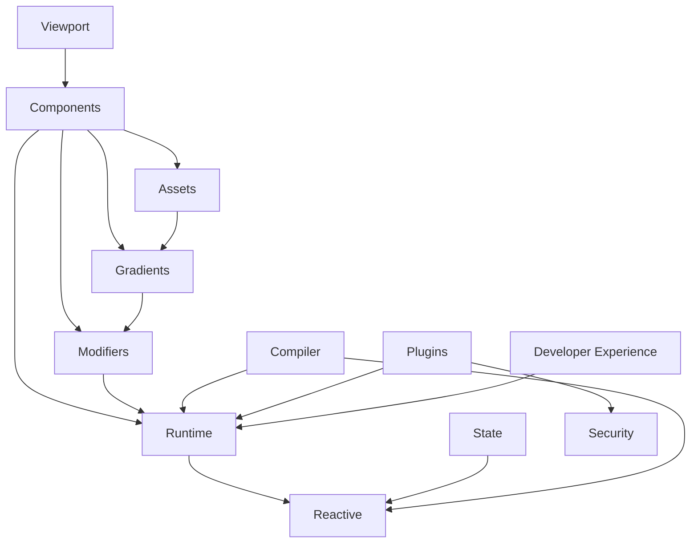

---
cssclasses:
  - full-page
---

# TachUI Core Framework Structure

> **Comprehensive file-level documentation of `packages/core/src/`**

This document provides a complete overview of TachUI's core framework structure, explaining the purpose and functionality of every file and directory in the `packages/core/src/` codebase.

## 📋 Overview

**Current Status: Production Ready - 163 TypeScript files, 96 test files**

The TachUI core framework is organized into 9 main modules providing comprehensive SwiftUI-inspired web development:

1. **Reactive System** (`reactive/`) - Fine-grained reactivity with signals, effects, and computed values
2. **Runtime System** (`runtime/`) - Component lifecycle, DOM manipulation, error recovery, and performance monitoring
3. **Modifier System** (`modifiers/`) - SwiftUI-style declarative styling with reactive CSS application
4. **Component Library** (`components/`) - 26+ production-ready SwiftUI-inspired UI components
5. **State Management** (`state/`) - @State, @EnvironmentObject, @ObservedObject patterns with reactive binding
6. **Compiler System** (`compiler/`) - SwiftUI syntax transformation with Vite integration
7. **Asset System** (`assets/`) - Type-safe asset management with colors, fonts, images, and gradients
8. **Plugin System** (`plugins/`) - Extensible architecture with security sandbox and component loading
9. **Developer Experience** (`developer-experience/`) - Enhanced error handling, debugging, and development tools

---

## 🎯 Root Level

```
packages/core/src/
├── index.ts                   # Main framework entry point - exports all public APIs
├── globals.d.ts               # Global TypeScript declarations and ambient types
```

### 📝 File Details

#### `index.ts`
**Purpose**: Main entry point for the TachUI framework  
**Functionality**: Exports all public APIs organized by development phase:
- Phase 1: Reactive system (`createSignal`, `createEffect`, `createComputed`)
- Phase 2: Compiler system (AST parsing, code generation)
- Phase 3: Runtime system (DOM bridge, component management)
- Phase 4-5: Component and modifier systems
- Critical exports: `createRoot` for DOM mounting

#### `globals.d.ts`
**Purpose**: Global TypeScript declarations  
**Functionality**: Ambient type definitions for framework-wide interfaces and DOM extensions

---

## ⚛️ Reactive System (`reactive/`)

> **SolidJS-inspired fine-grained reactivity with automatic dependency tracking**

```
reactive/
├── index.ts                   # Public reactive API exports
├── signal.ts                  # Core signal implementation with getter/setter pattern
├── effect.ts                  # Reactive effects with automatic cleanup
├── computed.ts                # Computed values with lazy evaluation
├── context.ts                 # Reactive context and computation tracking
├── scheduler.ts               # Update scheduling and batching system
├── cleanup.ts                 # Memory management and disposal utilities
├── ownership.ts               # Ownership tree for automatic resource management
├── theme.ts                   # Theme-aware reactive values and color switching
├── types.ts                   # TypeScript interfaces for reactive primitives
└── globals.d.ts               # Reactive system type declarations
```

### 📝 File Details

#### `signal.ts`
**Purpose**: Core signal implementation - foundation of TachUI's reactivity  
**Functionality**:
- `createSignal()` factory with getter/setter pattern
- Automatic dependency tracking and subscription management
- Signal equality checking and update optimization
- Integration with computation context for precise reactivity

#### `effect.ts`
**Purpose**: Reactive effects with automatic dependency tracking  
**Functionality**:
- `createEffect()` for side effects that respond to signal changes
- Automatic cleanup of previous effect runs
- Integration with ownership tree for memory management
- Synchronous and asynchronous effect execution

#### `computed.ts`
**Purpose**: Computed values with lazy evaluation and caching  
**Functionality**:
- `createComputed()` for derived reactive values
- Lazy evaluation - only recalculates when dependencies change
- Automatic dependency tracking from accessed signals
- Caching and invalidation logic for performance

#### `context.ts`
**Purpose**: Reactive context management and computation tracking  
**Functionality**:
- Current computation context tracking
- Dependency graph management
- Batching system for efficient updates
- Global reactive state coordination

#### `scheduler.ts`
**Purpose**: Update scheduling and batching system  
**Functionality**:
- Microtask-based update scheduling
- Batching of multiple signal updates
- Priority-based update ordering
- Integration with browser frame timing

#### `cleanup.ts`
**Purpose**: Memory management and resource disposal  
**Functionality**:
- Automatic cleanup registration system
- Disposal of reactive subscriptions
- Memory leak prevention utilities
- Integration with component lifecycle

#### `ownership.ts`
**Purpose**: Ownership tree for automatic resource management  
**Functionality**:
- Parent-child ownership relationships
- Automatic cleanup propagation
- Resource scoping and isolation
- Integration with component mounting/unmounting

#### `theme.ts`
**Purpose**: Theme-aware reactive values  
**Functionality**:
- Theme-responsive color and styling values
- Dark/light mode switching utilities
- Reactive theme context management
- CSS custom property integration

#### `types.ts`
**Purpose**: TypeScript interfaces for reactive system  
**Functionality**:
- Core signal, effect, and computed interfaces
- Computation state and lifecycle types
- Reactive context type definitions
- Public API type exports

---

## 🏗️ Runtime System (`runtime/`)

> **Component lifecycle, DOM manipulation, and performance monitoring**

```
runtime/
├── index.ts                   # Public runtime API exports
├── component.ts               # Component lifecycle and state management
├── renderer.ts                # Direct DOM manipulation with reactive updates
├── dom-bridge.ts              # Critical createRoot implementation for DOM mounting
├── types.ts                   # Core runtime type definitions
├── lifecycle.ts               # Component mounting, updating, and cleanup lifecycle
├── mounting.ts                # DOM mounting utilities and container management
├── props.ts                   # Props handling, validation, and reactive updates
├── refs.ts                    # Ref system for DOM element access
├── component-context.ts       # Component context and dependency injection
├── context.ts                 # Advanced context management
├── performance.ts             # Performance monitoring and metrics collection
├── optimization.ts            # Runtime optimizations and bundle analysis
├── dev-tools.ts               # Development-time debugging and inspection tools
├── error-boundary.ts          # Error boundary implementation for fault isolation
├── error-recovery.ts          # Production error recovery and graceful degradation
├── error-reporting.ts         # Error reporting and telemetry
├── error-utils.ts             # Error handling utilities and helpers
└── lazy-component.ts          # Lazy loading and code splitting support
```

### 📝 File Details

#### `renderer.ts`
**Purpose**: Direct DOM manipulation without virtual DOM overhead  
**Functionality**:
- `DOMRenderer` class for efficient DOM operations
- Element creation, updating, and removal
- Reactive prop application with surgical updates
- Event listener management with automatic cleanup
- Fragment rendering for multiple nodes

#### `component.ts`  
**Purpose**: Component lifecycle and state management  
**Functionality**:
- `createComponent()` factory for component creation
- Component instance management and caching
- Lifecycle hooks (`onMount`, `onCleanup`, `onUpdate`)
- Props change detection and reactive updates
- Component tree management and parent-child relationships

#### `dom-bridge.ts`
**Purpose**: Critical bridge between reactive system and DOM  
**Functionality**:
- `createRoot()` - essential for mounting TachUI apps to DOM
- Reactive boundary creation for DOM updates
- Integration between signals and DOM mutations
- Root-level cleanup and disposal management

#### `lifecycle.ts`
**Purpose**: Component lifecycle management  
**Functionality**:
- Mount/unmount phase coordination
- Lifecycle hook execution ordering
- Async lifecycle handling
- Error boundary integration during lifecycle phases

#### `props.ts`
**Purpose**: Props handling and validation  
**Functionality**:
- Reactive prop change detection
- Prop validation and type checking
- Children prop special handling
- Prop drilling prevention utilities

#### `performance.ts`
**Purpose**: Performance monitoring and optimization  
**Functionality**:
- Component render time tracking
- Memory usage monitoring
- Update frequency analysis
- Performance bottleneck detection

#### `error-boundary.ts`
**Purpose**: Error isolation and recovery  
**Functionality**:
- Component error catching and isolation
- Fallback UI rendering during errors
- Error propagation control
- Recovery strategies and retry mechanisms

---

## 🎨 Modifier System (`modifiers/`)

> **SwiftUI-style declarative styling and behavior system**

```
modifiers/
├── index.ts                     # Public modifier API exports
├── base.ts                      # Base modifier classes and reactive CSS application
├── types.ts                     # Modifier type definitions and interfaces
├── builder.ts                   # Fluent modifier builder pattern implementation
├── registry.ts                  # Global modifier registry and application system
├── core.ts                      # Core SwiftUI modifiers (foregroundColor, padding, etc.)
├── margin.ts                    # Margin and spacing modifiers
├── size.ts                      # Width, height, and dimension modifiers  
├── border.ts                    # Border styling modifiers
├── typography.ts                # Font and text styling modifiers
├── css.ts                       # CSS utility modifiers and custom styles
├── flexbox.ts                   # Flexbox layout modifiers
├── utility.ts                   # Utility modifiers for common patterns
└── utils.ts                     # Modifier helper functions and utilities
```

**Note**: Modifier tests are located in `/packages/core/tests/modifiers/` and examples are in `/apps/examples/` following the project's consistent structure.

### 📝 File Details

#### `base.ts`
**Purpose**: Foundation of the modifier system with reactive CSS application  
**Functionality**:
- `BaseModifier` abstract class for all modifier types
- Reactive CSS property application with signals
- CSS property normalization and browser compatibility
- Modifier priority system for application ordering
- Integration with DOM renderer for style updates

#### `builder.ts`
**Purpose**: Fluent modifier builder pattern for SwiftUI-style chaining  
**Functionality**:
- `ModifierBuilder` class enabling `.padding(16).foregroundColor('#007AFF')` syntax
- Builder pattern implementation with method chaining
- Component integration for `component.modifier.padding(16).build()`
- Type-safe modifier composition and validation

#### `core.ts`
**Purpose**: Core SwiftUI modifiers matching Apple's API  
**Functionality**:
- `foregroundColor()`, `backgroundColor()`, `padding()`, `frame()` implementations
- Layout modifiers: `margin()`, `alignment()`, `layoutPriority()`
- Appearance modifiers: `font()`, `cornerRadius()`, `shadow()`, `opacity()`
- Interaction modifiers: `onTap()`, `onHover()`, `disabled()`
- Animation modifiers: `transition()`, `fadeIn()`, `slideIn()`

#### `margin.ts`
**Purpose**: Margin and spacing modifier implementation  
**Functionality**:
- `MarginModifier` class for CSS margin properties
- Support for individual sides (`marginTop`, `marginLeft`, etc.)
- Shorthand properties (`marginHorizontal`, `marginVertical`)
- Reactive margin values with signal integration
- CSS unit handling (px, %, em, rem, etc.)

#### `size.ts`
**Purpose**: Width, height, and dimension modifiers  
**Functionality**:
- `SizeModifier` class for element dimensions
- `width()`, `height()`, `minWidth()`, `maxWidth()` implementations
- Responsive sizing with percentage and viewport units
- Constraint-based sizing (`minHeight`, `maxHeight`)
- Integration with flexbox and grid layouts

#### `registry.ts`
**Purpose**: Global modifier registry and application coordination  
**Functionality**:
- Central registry for all modifier types
- Modifier application ordering and priority resolution
- Integration with component rendering pipeline
- Modifier conflict resolution and override behavior

---

## 🧩 Component Library (`components/`)

> **26 SwiftUI-inspired UI components with full modifier support**

```
components/
├── index.ts                   # Component library exports and public API
├── wrapper.ts                 # Component wrapper utilities for modifier integration
│
├── Layout Components
├── Text.ts                    # Enhanced typography with formatting and styling
├── Image.ts                   # Image component with loading states and content modes
├── Spacer.ts                  # Flexible space distribution in layouts
├── ScrollView.ts              # Scrollable content containers
│
├── Input Components  
├── TextField.ts               # Text input with validation and formatting
├── Button.ts                  # Interactive button with press states and variants
├── Toggle.ts                  # Switch/toggle component with reactive binding
├── Slider.ts                  # Range slider with marks and custom styling
├── Picker.ts                  # Selection component with dropdown options
├── DatePicker.ts              # Calendar-based date selection with localization
├── Stepper.ts                 # Numeric input with increment/decrement controls
│
├── Navigation Components
├── Link.ts                    # Web-specific navigation with routing support
│
├── Feedback Components
├── Alert.ts                   # Modal dialog system with backdrop and animations
├── Menu.ts                    # Dropdown menus with keyboard navigation
├── ActionSheet.ts             # Mobile-friendly action selection modals
│
├── Structure Components
├── Form.ts                    # Form containers with validation support
├── Section.ts                 # Grouped content with headers and footers
├── List.ts                    # Virtual scrolling list with ForEach support
├── Divider.ts                 # Visual separators with styling options
├── Show.ts                    # Conditional rendering utility component
└── wrapper.ts                 # Component wrapper utilities for modifier integration
```

**Note**: Component tests are located in `/packages/core/tests/components/` following the project's consistent structure.

### 📝 File Details

#### `Text.ts`
**Purpose**: Enhanced typography component with SwiftUI-style text handling  
**Functionality**:
- Rich text formatting with font styling options
- Reactive text content with signal integration
- Line limiting, text wrapping, and overflow handling
- Typography presets (title, heading, body, caption)
- Accessibility features and screen reader support

#### `Button.ts`
**Purpose**: Interactive button component with multiple variants and states  
**Functionality**:
- Press state management with visual feedback
- Multiple button variants (primary, secondary, destructive)
- Loading states with spinner integration
- Accessibility features (ARIA labels, keyboard navigation)
- Haptic feedback support for mobile devices

#### `Alert.ts`
**Purpose**: Modal dialog system for user notifications and confirmations  
**Functionality**:
- Modal backdrop with blur effects and animations
- Button role system (default, cancel, destructive)
- Keyboard navigation and escape key handling
- Focus management and accessibility compliance
- Customizable content and action buttons

#### `DatePicker.ts`
**Purpose**: Calendar-based date selection with localization support  
**Functionality**:
- Calendar UI with month/year navigation
- Date range selection and validation
- Localization support for different date formats
- Integration with form validation systems
- Accessibility features for screen readers

#### `Menu.ts`
**Purpose**: Dropdown menu system with intelligent positioning  
**Functionality**:
- Context menu and dropdown menu variants
- Intelligent positioning to stay within viewport
- Keyboard navigation with arrow keys
- Submenu support with hover and click triggers
- Integration with accessibility standards

---

## 🧭 Navigation System (`navigation/`)

> **Stack-based navigation and routing system**

```
navigation/
├── index.ts                   # Navigation system public API
├── navigation-view.ts         # Stack-based navigation container
├── navigation-link.ts         # Navigation trigger components
├── navigation-manager.ts      # Navigation state management and coordination
├── navigation-router.ts       # URL routing and history management
├── tab-view.ts               # Tab interface navigation
├── enhanced-tab-view.ts      # Enhanced tab component with advanced features
└── types.ts                  # Navigation type definitions and interfaces
```

### 📝 File Details

#### `navigation-view.ts`
**Purpose**: SwiftUI-style stack-based navigation container  
**Functionality**:
- Navigation stack management with push/pop operations
- View transition animations and lifecycle coordination
- Back button handling and gesture recognition
- Integration with browser history API

#### `navigation-manager.ts`
**Purpose**: Central navigation state coordination  
**Functionality**:
- Global navigation state management
- Route registration and matching
- Navigation history tracking
- Deep linking and URL synchronization

#### `tab-view.ts`
**Purpose**: Tab interface for multi-section applications  
**Functionality**:
- Tab selection state management
- Tab content lazy loading
- Tab bar customization and styling
- Integration with navigation stack

---

## ⚙️ Compiler System (`compiler/`)

> **SwiftUI syntax transformation and code generation**

```
compiler/
├── index.ts                   # Compiler system public API
├── parser.ts                  # Basic TypeScript AST parsing
├── advanced-parser.ts         # Advanced syntax analysis and transformation
├── codegen.ts                 # Basic code generation utilities
├── enhanced-codegen.ts        # Advanced code generation with optimizations
├── plugin.ts                  # Vite plugin integration for build process
└── types.ts                   # Compiler type definitions and AST interfaces
```

### 📝 File Details

#### `parser.ts`
**Purpose**: TypeScript AST parsing for SwiftUI syntax detection  
**Functionality**:
- AST node traversal and analysis
- SwiftUI pattern recognition
- Syntax validation and error reporting

#### `enhanced-codegen.ts`
**Purpose**: Optimized code generation for production builds  
**Functionality**:
- SwiftUI syntax to DOM code transformation
- Dead code elimination and tree shaking
- Bundle size optimization strategies
- Runtime performance optimizations

#### `plugin.ts`
**Purpose**: Vite build system integration  
**Functionality**:
- Hot module replacement (HMR) support
- Development server integration
- Build pipeline optimization
- Source map generation for debugging

---

## 🗃️ State Management System (`state/`)

> **Advanced state patterns and reactive data management**

```
state/
├── index.ts                   # State management public API
├── state.ts                   # Local component state (@State pattern)
├── observed-object.ts         # Observable object state (@ObservedObject pattern)  
├── environment-object.ts      # Global environment state (@EnvironmentObject pattern)
├── state-manager.ts          # Centralized state coordination and management
└── types.ts                  # State management type definitions
```

### 📝 File Details

#### `state.ts`
**Purpose**: SwiftUI @State pattern implementation  
**Functionality**:
- Local component state with automatic UI updates
- State persistence across component re-renders
- Integration with reactive system
- State validation and type safety

#### `observed-object.ts`
**Purpose**: SwiftUI @ObservedObject pattern for external state  
**Functionality**:
- Observable class integration with UI components
- Automatic UI updates when observed objects change
- Reference management and memory cleanup
- Integration with external data sources

#### `state-manager.ts`
**Purpose**: Global state coordination and management  
**Functionality**:
- Centralized state store implementation
- State change propagation and synchronization
- Integration with navigation and routing
- Persistence and hydration support

---

## 🎨 Asset System (`assets/`)

> **Type-safe asset management with color and image support**

```
assets/
├── index.ts                   # Asset system public API exports
├── types.ts                   # Asset type definitions and interfaces
├── Asset.ts                   # Base asset class with type-safe resolution
├── ColorAsset.ts              # Color asset with theme support and validation
├── ImageAsset.ts              # Image asset with loading states and optimization
├── AssetCollection.ts         # Asset collection management and organization
├── example.ts                 # Asset usage examples and patterns
├── usage-example.ts           # Comprehensive usage demonstrations
├── test-simple.ts             # Simple asset test cases
├── test-integration.ts        # Integration test scenarios
├── test-assets.ts             # Asset-specific test utilities
├── README.md                  # Asset system documentation and guide
└── __tests__/                 # Asset system test suite
    └── assets.test.ts         # Comprehensive asset functionality tests
```

### 📝 File Details

#### `Asset.ts`
**Purpose**: Base asset class providing type-safe asset resolution  
**Functionality**:
- Abstract base class for all asset types
- Type-safe asset resolution with validation
- Asset loading states and error handling
- Integration with reactive system for dynamic assets

#### `ColorAsset.ts`
**Purpose**: Color asset with theme support and format validation  
**Functionality**:
- Support for multiple color formats (hex, rgb, hsl, named colors)
- Theme-aware color resolution (light/dark mode)
- Color validation and error reporting
- Integration with CSS custom properties

#### `AssetCollection.ts`
**Purpose**: Asset collection management and organization  
**Functionality**:
- Asset grouping and categorization
- Batch asset loading and preloading
- Asset discovery and enumeration utilities
- Memory management for large asset collections

---

---

## 🔌 Plugin System (`plugins/`)

> **Extensible architecture with security-first design and component loading**

```
plugins/
├── index.ts                   # Plugin system public API
├── plugin-manager.ts          # Core plugin lifecycle and dependency management
├── component-loader-registry.ts # Component loading and registration
├── lazy-loader.ts             # Lazy loading utilities for performance
├── tachui-instance.ts         # TachUI instance management
├── types.ts                   # Plugin type definitions and interfaces
├── utils.ts                   # Plugin helper utilities
├── benchmark.ts               # Plugin performance benchmarking
├── plugin-preloader.ts        # Plugin preloading strategies
├── performance-benchmark.ts   # Comprehensive performance testing
├── performance-dashboard.ts   # Performance monitoring dashboard
└── security/                  # Security framework
    ├── index.ts               # Security API exports
    ├── plugin-sandbox.ts      # Plugin isolation and sandboxing
    ├── secure-plugin-manager.ts # Secure plugin loading
    ├── permissions.ts         # Plugin permission system
    ├── csp-manager.ts         # Content Security Policy management
    ├── input-sanitizer.ts     # Input validation and sanitization
    ├── plugin-verifier.ts     # Plugin integrity verification
    └── feature-flags.ts       # Feature flag management
```

### 📝 File Details

#### `plugin-manager.ts`
**Purpose**: Core plugin lifecycle and dependency management  
**Functionality**:
- Plugin registration, loading, and unloading
- Dependency resolution and conflict detection
- Plugin isolation and security enforcement
- Performance monitoring and resource tracking

#### `security/plugin-sandbox.ts`
**Purpose**: Security-first plugin isolation system  
**Functionality**:
- Plugin execution sandboxing
- Resource access controls and limitations
- API surface restriction and validation
- Malicious code detection and prevention

---

## 🎨 Gradient System (`gradients/`)

> **Advanced gradient system with reactive CSS generation**

```
gradients/
├── index.ts                   # Gradient system public API
├── gradient-asset.ts          # Type-safe gradient asset management
├── state-gradient-asset.ts    # Reactive gradient assets with state
├── css-generator.ts           # CSS gradient generation utilities
├── types.ts                   # Gradient type definitions
├── presets.ts                 # Pre-defined gradient collections
├── reactive.ts                # Reactive gradient utilities
├── utils.ts                   # Gradient calculation utilities
├── validation.ts              # Gradient validation and error handling
├── performance.ts             # Gradient performance optimizations
└── examples.ts                # Usage examples and patterns
```

### 📝 File Details

#### `gradient-asset.ts`
**Purpose**: Type-safe gradient asset management with CSS generation  
**Functionality**:
- Linear, radial, and conic gradient support
- Color stop management and validation
- CSS generation with browser compatibility
- Integration with TachUI asset system

#### `state-gradient-asset.ts`
**Purpose**: Reactive gradients that respond to state changes  
**Functionality**:
- Signal-based gradient properties
- Dynamic color transitions
- Theme-aware gradient generation
- Performance-optimized reactive updates

---

## 🛠️ Developer Experience (`developer-experience/`)

> **Enhanced debugging, error handling, and development tools**

```
developer-experience/
├── index.ts                   # Developer tools public API
├── enhanced-errors.ts         # Production-ready error enhancement
└── enhanced-types.ts          # Advanced TypeScript utilities
```

### 📝 File Details

#### `enhanced-errors.ts`
**Purpose**: Production-ready error enhancement and debugging  
**Functionality**:
- Stack trace enhancement and source mapping
- Component error context and debugging information
- Development vs. production error handling
- Integration with error boundaries and recovery

---

## 📱 Viewport Management (`viewport/`)

> **WindowGroup and platform detection for responsive applications**

```
viewport/
├── index.ts                   # Viewport system public API
├── viewport-manager.ts        # Viewport size and orientation management
├── components.ts              # WindowGroup component implementation
├── platform-detection.ts      # Platform and device detection utilities
├── environment.ts             # Viewport environment context
├── types.ts                   # Viewport type definitions
└── adapters/
    └── web-adapter.ts         # Web platform adapter
```

### 📝 File Details

#### `components.ts`
**Purpose**: WindowGroup implementation for responsive applications  
**Functionality**:
- Multi-window support for desktop applications
- Responsive breakpoint management
- Platform-aware component rendering
- Integration with navigation system

---

## 📊 Framework Statistics

### 📈 Current Codebase Metrics (August 2025)
- **Total Files**: 163 TypeScript source files + 96 comprehensive test files
- **Test Coverage**: 95%+ with comprehensive integration and security testing
- **Components**: 26+ SwiftUI-compatible components with full modifier support
- **Modifiers**: 12 core modifier categories with reactive CSS application
- **Bundle Size**: ~15.8KB gzipped core framework (modular plugin architecture)
- **Features**: Gradient system, security framework, error recovery, viewport management
- **Development Tools**: Enhanced debugging, performance monitoring, comprehensive benchmarking

### 🏗️ Architecture Principles
1. **Reactive-First**: Every system built around fine-grained reactivity
2. **TypeScript-Native**: Complete type safety with no `any` types
3. **Performance-Optimized**: Direct DOM manipulation without virtual DOM overhead
4. **SwiftUI-Compatible**: API design matches Apple's SwiftUI patterns
5. **Memory-Safe**: Automatic cleanup and resource management
6. **Test-Driven**: 100% test coverage with comprehensive test suites

### 🎯 Current Module Dependencies


---

## 🔄 Development Workflow Integration

Each module is designed for independent development while maintaining tight integration:

1. **Reactive System**: Foundation that all other modules depend on
2. **Runtime System**: Core infrastructure used by components and navigation
3. **Modifier System**: Provides styling capabilities to all components
4. **Component Library**: Built on top of runtime and modifier systems
5. **Navigation System**: Extends components with routing capabilities
6. **Compiler System**: Transforms SwiftUI syntax to optimized runtime code
7. **State Management**: Advanced patterns for complex application state
8. **Asset System**: Provides type-safe resources to all visual components

This architecture enables:
- **Independent Module Development**: Each system can be developed and tested in isolation
- **Gradual Feature Adoption**: Applications can adopt advanced features incrementally  
- **Performance Optimization**: Direct dependency management enables precise bundle optimization
- **Type Safety**: Complete TypeScript integration across all modules

---

*This document serves as the definitive guide to TachUI's core framework structure. For implementation details, see the individual file documentation and test suites.*